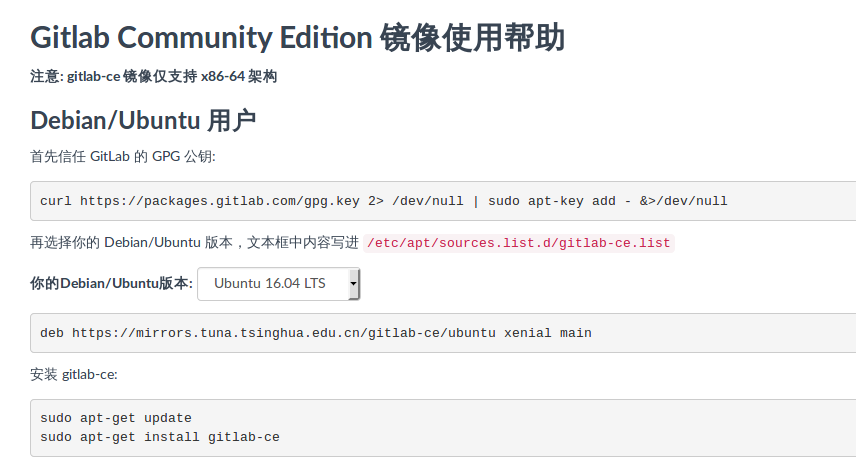
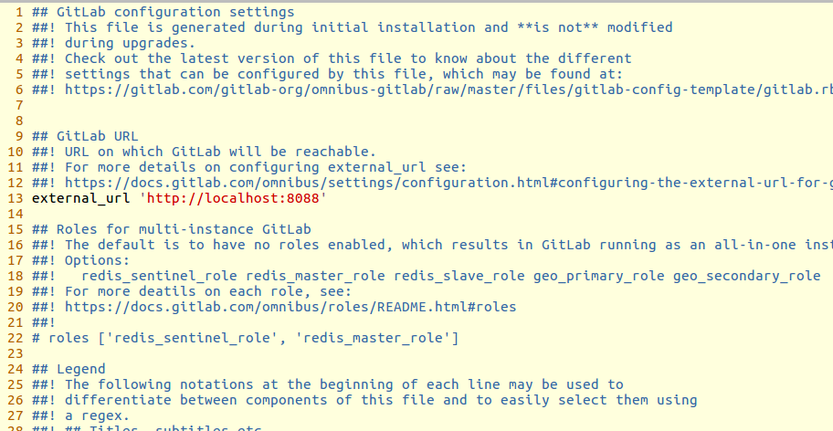

# GitLab使用配置

## 下载安装
### 下载

url地址为：https://mirror.tuna.tsinghua.edu.cn/help/gitlab-ce/
```
curl https://packages.gitlab.com/gpg.key 2> /dev/null | sudo apt-key add - &>/dev/null
deb https://mirrors.tuna.tsinghua.edu.cn/gitlab-ce/ubuntu xenial main
sudo apt-get update
sudo apt-get install gitlab-ce
```
以上是ubuntu16.0.4TSL版本的安装代码

安装完成之后，会有提示信息，告知去修改host

```
sudo vim /etc/gitlab/gitlab.rb

```


注意与nginx默认80端口冲突，所以最好换其他端口号
修改完后，执行配置更新,并启动
```
sudo gitlab-ctl reconfigure
sudo gitlab-ctl start
```


其他参考命令
```
sudo gitlab-ctl reconfigure 	重新加载配置，每次修改/etc/gitlab/gitlab.rb文件之后执行
sudo gitlab-ctl status 	查看 GitLab 状态
sudo gitlab-ctl start 	启动 GitLab
sudo gitlab-ctl stop 	停止 GitLab
sudo gitlab-ctl restart 	重启 GitLab
sudo gitlab-ctl tail 	查看所有日志
sudo gitlab-ctl tail nginx/gitlab_acces.log 	查看 nginx 访问日志
sudo gitlab-ctl tail postgresql 	查看 postgresql 日志
```


## 配置
